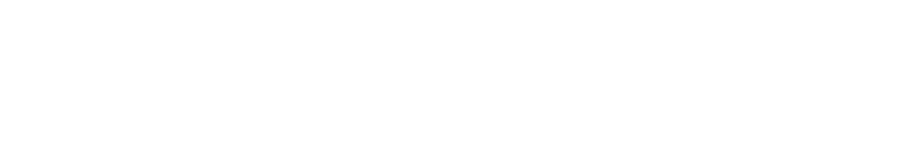
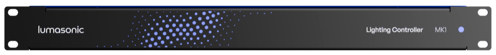
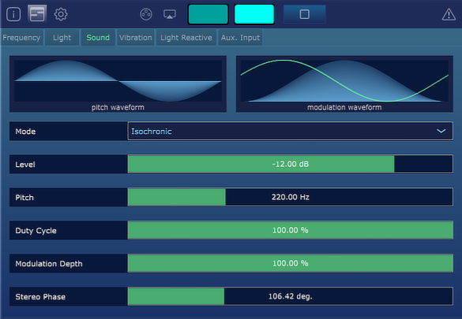

This repository holds the legacy documentation and binary releases of Prism Studio and the 
Lumasonic Decoder SDK from Cymatic Somatics Inc. Although the company has ceased
business operations, it has decided to make its work publicly available. Additionally, in
the future, the source for the tools will also be released in an additional repository.

Prism Studio and the Lumasonic codec are used to encode and decode visual control signals into 
audio signals. Prism Studio also supports encoding of [AudioStrobe](https://audiostrobe.com/)
and [SpectraStrobe](docs/08-SpectraStrobe/01-spectrastrobe-introduction.md) for
wider compatibility with existing hardware devices such as the [MindPlace Kasina](https://mindplace.com/).

Prism Studio consists of cross-platform VST3 audio plug-ins and the
Lumasonic Decoder SDK offers static binary libraries that can be used to implement
custom decoding software for content encoded with Prism Studio and the Lumasonic codec.

Please refer to the [documentation](./docs/01-Installation/01-introduction.md)
for more information on how to install and use this software.

This software is licensed under the [MIT license](./LICENSE).

---

## Donate

If you have already received value from our work, or you would like to support the
continued development of the Lumasonic ecosystem, please consider [donating](https://www.paypal.com/donate/?business=GRU28YRJXKYRG&no_recurring=0&item_name=Thank+you+for+supporting+the+Lumasonic+project%21&currency_code=USD)!

Donating helps us to continue to transition this massive body of work to an open source format. 

Our efforts to prepare and document the entire code base for a source code release require
ongoing time and effort, and your donation can help accelerate the process.

With enough of your support, we can also look towards releasing our hardware reference designs
for external LED lighting controller or our portable low-cost decoder, allowing anyone to implement
a complete Lumasonic and AudioStrobe playback system.

## Downloads

### Prism Studio VST3s

* [Windows](https://github.com/Lumasonic/Lumasonic/releases/download/prism-studio-v1.0.2/PrismStudio_win.zip)
* [macOS](https://github.com/Lumasonic/Lumasonic/releases/download/prism-studio-v1.0.2/PrismStudio_macOS.zip)
* [Documentation](./docs/01-Installation/01-introduction.md)

### Lumasonic Decoder SDK

* [Windows (Intel), Linux (Intel, Arm)](https://github.com/Lumasonic/Lumasonic/releases/download/lumasonic-sdk-v1.0.2/LumasonicDecoderSDK_v1.0.2.zip)

---

## A Message from Cymatic Somatics Inc.

### A Journey Concludes

After five incredible years of pushing the boundaries of multi-sensory experiences, we have made the difficult decision to wind down Cymatic Somatics.

### Reflecting on Our Impact

What began as a personal journey toward healing through the intersection of art and technology evolved into something much larger. Together, we created tools that enabled countless individuals and businesses to craft therapeutic experiences combining light, sound, and vibration. Our Prism Studio and Lumasonic Engine touched lives across the wellness community, from brainwave entrainment practitioners to those seeking new pathways to healing and connection.

We're deeply proud of the technology we built and the community we fostered. The multi-sensory artists, practitioners, and innovators who embraced our vision helped prove that synchronized experiences across the senses can create profound therapeutic responses and open entirely new creative possibilities.

### The Road Here

Like many ventures, our journey has been marked by both extraordinary breakthroughs and significant challenges. The pandemic and subsequent supply chain difficulties tested our resilience, while the evolving market landscape presented obstacles we ultimately could not overcome. Despite encouraging signals from potential partners and the continued passion of our community, the financial realities led us to this crossroads.

### Looking Forward

While this chapter of Cymatic Somatics is ending, our hope for the technology's future remains bright. We envision a world where multi-sensory healing tools continue to evolve and reach those who need them most. The foundational work we've accomplished—proving that synchronized light, sound, and vibration can create meaningful therapeutic experiences—will hopefully inspire others to carry this vision forward alongside us.

### Our Gratitude

To everyone who believed in our mission, tested our tools, provided feedback, and shared our excitement for this emerging field: thank you. Your support and enthusiasm made this journey meaningful beyond measure. You helped us prove that taking healing into our own hands is not just possible, but transformative.

We remain grateful for the opportunity to explore this remarkable intersection of technology and healing alongside all of you.

_With deep appreciation, 
Michael and Josiah 
Co-founders, Cymatic Somatics Inc._
