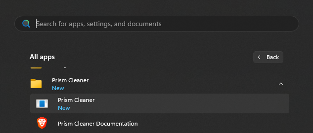
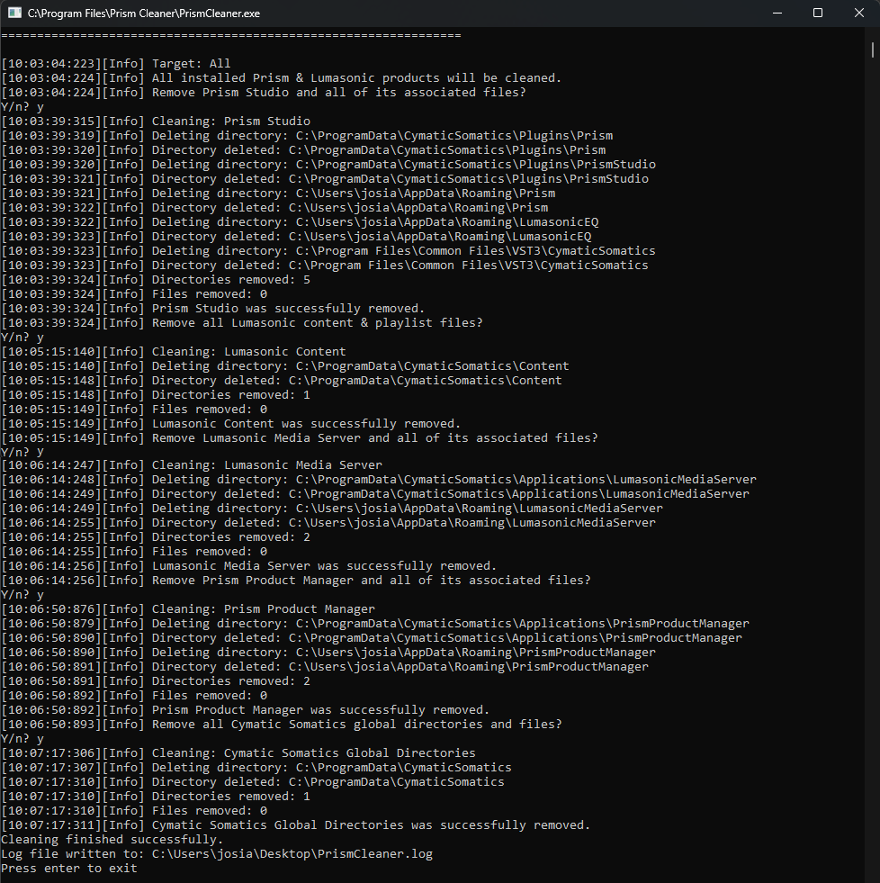
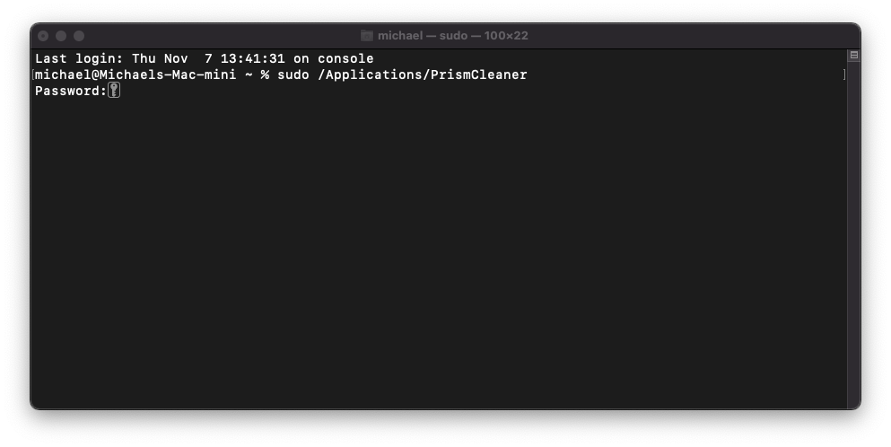

### Introduction
While previous Prism Studio versions relied on Prism Product Manager for plugin installation and license activation,
this is now a manual process for the free plugins, with the installation steps outlined in the 
[Installing Plugins](02-installing-plugins.md) docs.

If you have ever installed a Prism Studio product on Windows or macOS before, you will need to first go through the steps below
to install and run Prism Cleaner.

---

### Prism Cleaner
Prism Cleaner is a command line utility tool that clears out all files related to previous installations of
Prism Studio and related products. This ensures a clean starting point for installing and using the latest plugins.

Please download and run the Prism Cleaner installer for your operating system: [Windows](../../binaries/win/PrismCleanerSetup.exe) 
or [macOS](../../binaries/macOS/PrismCleanerSetup.pkg)

---

### Getting Started

Start by closing any DAW that you may have open. This is required to clear out all existing Prism plug-ins.

When launched, Prism Cleaner will explain all of the steps it is about to take to clean your system of all 
Cymatic Somatics software. To accept the default and clean everything, simply press Enter/Return at each prompt. 

For examples on Windows and macOS, please see their respective sections below.

**IMPORTANT**: If you receive a warning during any of these steps, simply follow the onscreen instructions. After
Prism Cleaner is finished running, the log file `PrismCleaner.log` will be created on your desktop for further
investigation.

Prism Cleaner will walk through the following prompts:
1. Remove Prism Studio and all of its associated files?
2. Remove all Lumasonic content & playlist files?
3. Remove Lumasonic Media Server and all of its associated files?
4. Remove Prism Product Manager and all of its associated files?
5. Remove all Cymatic Somatics global directories and files?

This will ensure that ANY previous installations of Prism Product Manager, Lumasonic Media Server (and content), and
any Prism Studio tools are completely cleared.

### Windows

For Windows, find Prism Cleaner in the Start menu (either by searching by name or looking through `All apps`) and 
run it.

The dialog will walk you through the process. Simply close the window if you want to cancel at any point.

### macOS

Open a Terminal window, type `sudo /Applications/PrismCleaner`, and hit Enter/Return to run Prism Cleaner. 
Enter your password to begin the process, and you will be walked through the steps in the same fashion as the above
Windows example.

At any point you can exit the process by pressing `Ctrl+C` on your keyboard

