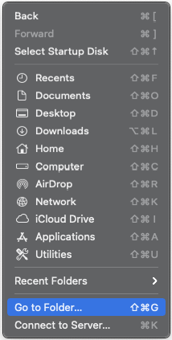
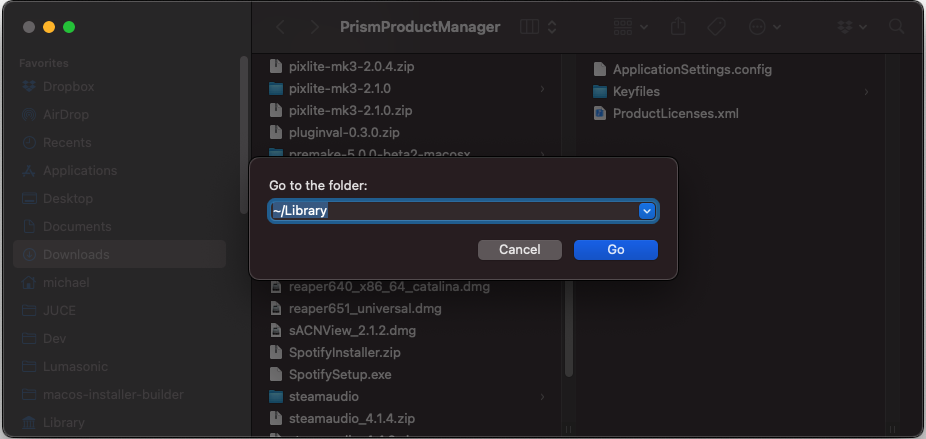
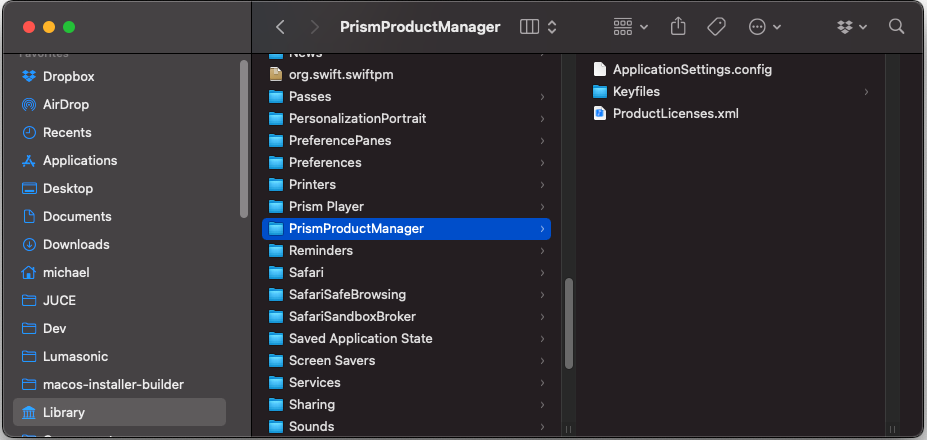

### Important Prerequisites
Before installing Prism Product Manager, it is vital to run [Prism Cleaner](01-introduction.md) if you have ever installed
a previous Prism release. This will ensure a clean starting point, free of leftover files and directories from all 
previous beta releases.

---

### Requirements
The requirements for running all Prism Studio plug-ins are listed below. All plug-ins are in the VST3 format and 
must be run within a supporting DAW.

#### Windows System Requirements
* `Windows 10 64 bit`
* `See your DAW's minimum system specs`

#### macOS System Requirements
* `macOS 64 bit (Intel or M1/M2)` version 10.15.7 or later
* `See your DAW's minimum system specs`

_**NOTE**: macOS native DAWs such as **Logic** often only support AudioUnit plug-ins natively, but you can use a VST3 wrapper product to
utilize Prism Studio tools within them. Alternatively, we suggest continuing your music production in your macOS
DAW of choice, and then utilizing **Reaper**, **Tracktion Waveform**, **Ableton Live**, or another VST3 supporting DAW to do
a visuals pass on your bounced track using Prism Studio tools._

---

### Installation
Please download appropriate VSTs for desired OS from the [binaries](../../binaries) folder. Unzip somewhere to reveal all
plugins (PrismVST, PrismAudioBus, PrismMonitor, and PrismReference), the follow the instructions for your OS below.

Then follow the instructions laid out in the [Prism Studio](../02-Prism-Studio/01-introduction.md) docs to finish the configuration in your DAW.

---

#### Windows

Copy VSTs to `C:\Program Files\Common Files\VST3` directory (this will require admin privileges). Feel free to create a
subdirectory called `Lumasonic` and place the plugins there for organization.

Download and unzip [PrismStudio_LicenseKeyFiles.zip](../../binaries/license/PrismStudio_LicenseKeyFiles.zip). Copy the
`PrismProductManager` folder to your `C:\Users\YOURUSERNAME\AppData\Roaming` directory (replacing YOURUSERNAME
with the appropriate local user).

---

#### macOS

Copy VSTs to one of the standard system locations:
- System-wide installation: `/Library/Audio/Plug-Ins/VST3/`
- User-specific installation: `~/Library/Audio/Plug-Ins/VST3/`

Download and unzip [PrismStudio_LicenseKeyFiles.zip](../../binaries/license/PrismStudio_LicenseKeyFiles.zip). Copy the
`PrismProductManager` folder to your `~/Library/` directory (revealed via Finder -> Go (menu) -> Go to Folder -> ~/Library.

