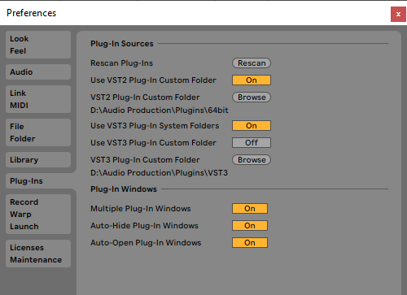
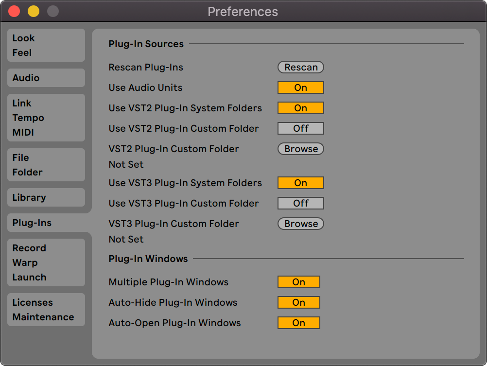
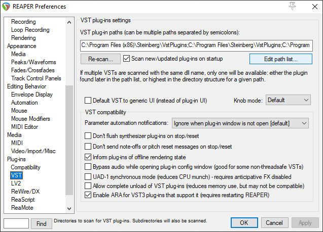
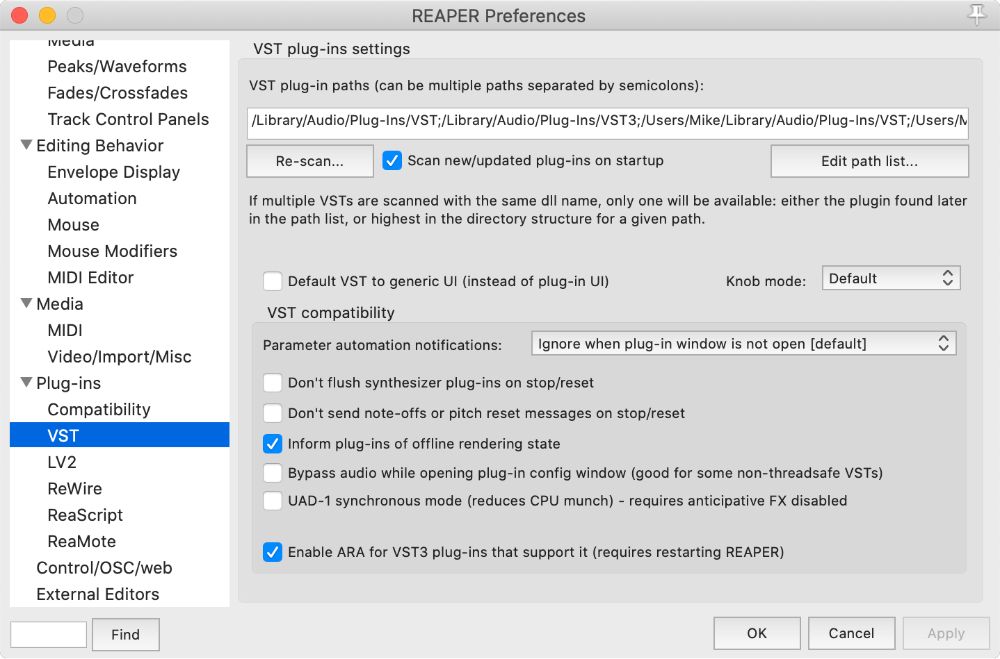
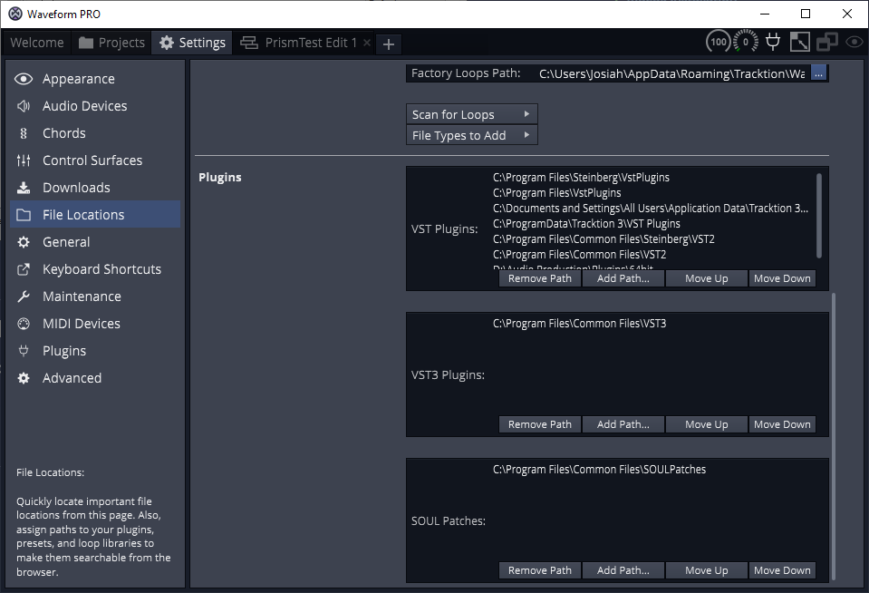
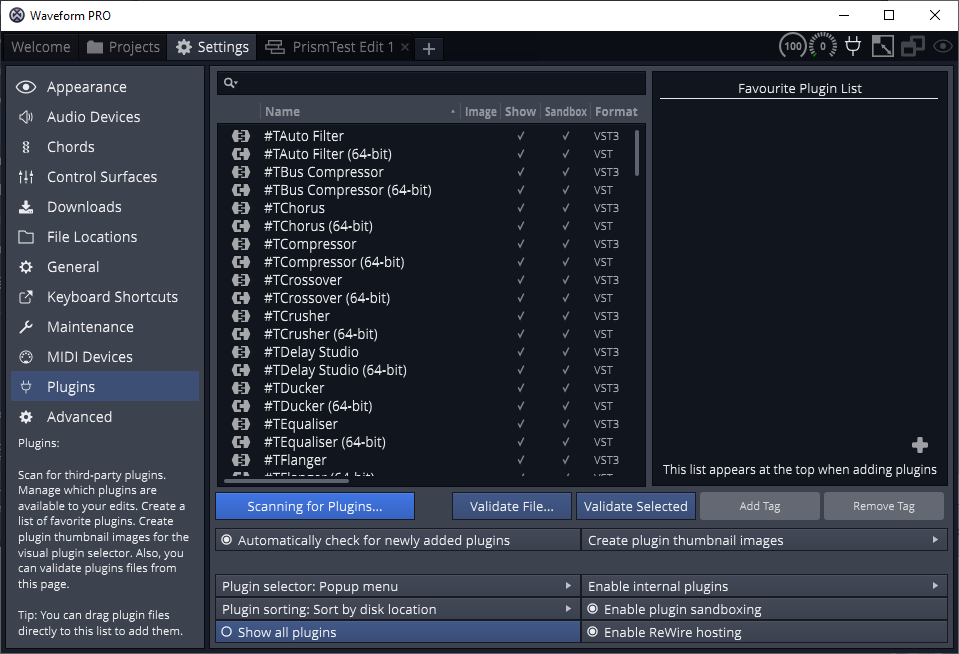
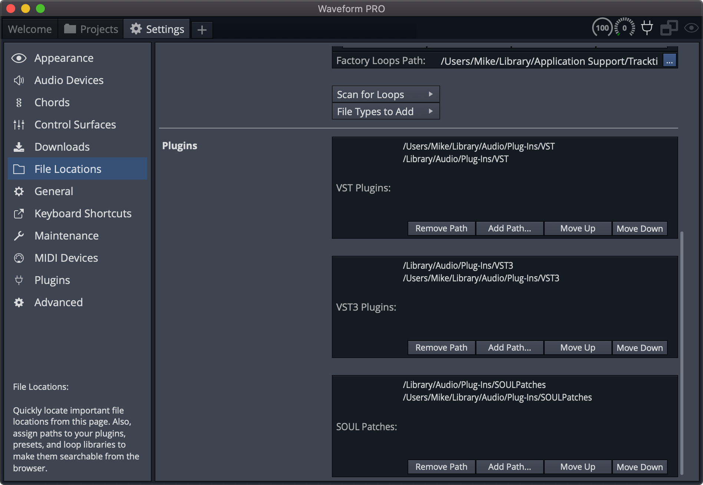
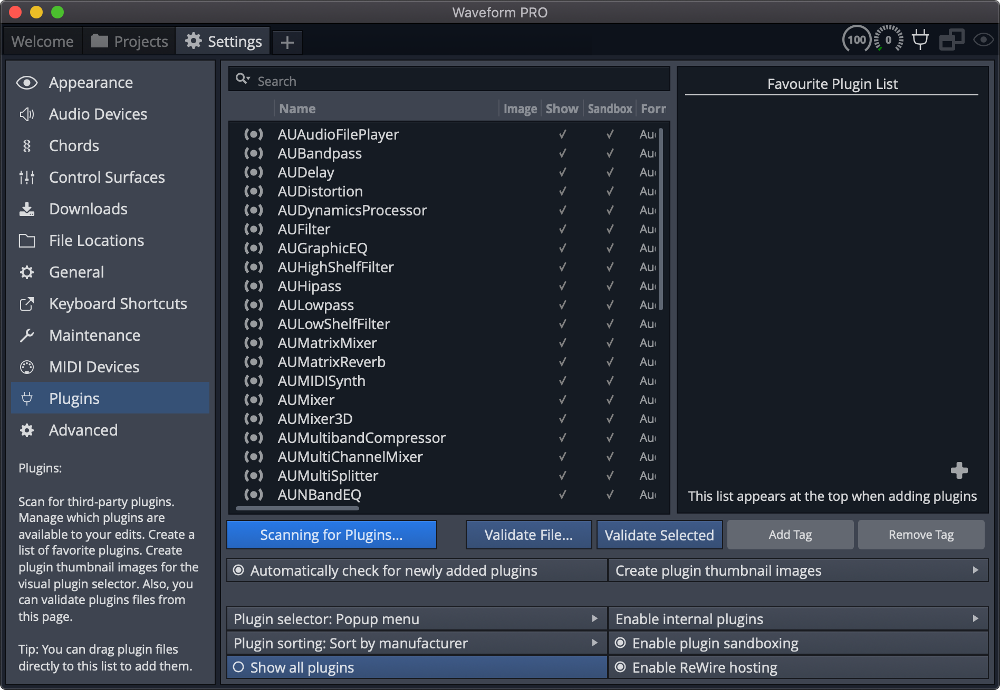

### Plugin Location
Prism Studio tools are packaged as **VST3** plugins.

If you haven't already configured your DAW to scan for your **VST3** directory, this guide will help you configure it to do so. We will cover a few different DAWs, which should provide clues for finding this within ones which we don't outline here.

_**NOTE**: These instructions are based on installation of the plug-ins into the standard system folders. When using a custom
directory, add that folder to your scanning location as well._

---

### Ableton Live

_**Note**: VST3 plug-ins are supported in **Ableton Live 10** and above..._

**Windows**

1. Select `Options->Preferences` from the application title bar (or use `Ctrl+,`) to bring up the application **Preferences**. 
2. Select `Plug-Ins` from the menu on the left, and enable `Use VST3 Plug-In System Folders`. This will scan for VST3 plug-ins in the default folder (`C:\Program Files\Common Files\VST3`).
3. Click the `Rescan` button to scan for plug-ins after enabling this option.

**macOS**

1. Select `Preferences` from the application title bar (or use `Cmd+,`) to bring up the application **Preferences**.
2. Select `Plug-Ins` from the menu on the left, and enable `Use VST3 Plug-In System Folders`. This will scan for VST3 plug-ins in the default folder (`/Library/Audio/Plug-Ins/VST3`).
3. Click the `Rescan` button to scan for plug-ins after enabling this option.

---

### Reaper

_**Note**: VST3 plug-ins are supported in **Reaper 6** and above..._

**Windows**

1. Select `Options->Preferences` from the application title bar (or use `Ctrl+P`) to bring up the application **Preferences**.
2. Under the `Plug-ins` section on the left, select `VST`.
3. Click the `Edit path list...` button in the top right of the dialog, and ensure your system **VST3** is included (`C:\Program Files\Common Files\VST3`).
4. If adding the VST3 path in the previous step, click the `Rescan` button to scan for new plug-ins.

**macOS**

1. Select `Preferences` from the application title bar (or use `Ctrl+,`) to bring up the application **Preferences**.
2. Under the `Plug-ins` section on the left, select `VST`.
3. Click the `Edit path list...` button in the top right of the dialog, and ensure your system **VST3** is included (`/Library/Audio/Plug-Ins/VST3`).
4. If adding the VST3 path in the previous step, click the `Rescan` button to scan for new plug-ins.

---

### Tracktion Waveform

_**Note**: VST3 plug-ins are supported in **Waveform 10** and above..._

**Windows**

1. Select `Settings` from the application title bar.
2. Select the `File Locations` section on the left, and scroll down to the **Plugins** area.
3. Ensure your system **VST3** path is (`C:\Program Files\Common Files\VST3`) is included in the **VST3 Plugins** section. If not, click the `Add Path...` button and add the system path.

4. Select the `Plugins` section on the left.
5. Click the `Scanning for Plugins...` button and select `Scan for new or updated VST3 plugins`.

**macOS**

1. Select `Settings` from the application title bar.
2. Select the `File Locations` section on the left, and scroll down to the **Plugins** area.
3. Ensure your system **VST3** path is (`/Library/Audio/Plug-Ins/VST3`) is included in the **VST3 Plugins** section. If not, click the `Add Path...` button and add the system path.

4. Select the `Plugins` section on the left.
5. Click the `Scanning for Plugins...` button and select `Scan for new or updated VST3 plugins`.

---

**[NEXT: Prism Plugin Overview](../03-Prism-VST/01-prism-plugin-overview.md)**