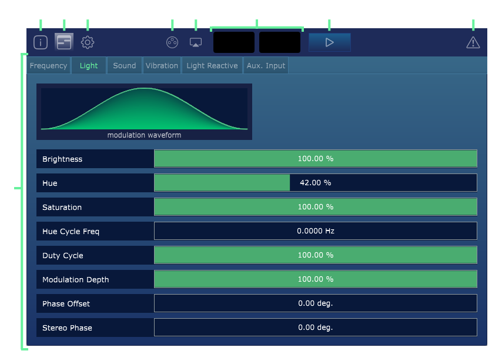

### About the Prism Plug-in

Prism is design to make synchronized multi-sensory content (light/sound/vibration) easy and fun to create, for 
playback in custom [Lumasonic](../08-Lumasonic/01-lumasonic-overview.md) hardware, or on existing MindPlace hardware such as the [Kasina](https://mindplace.com/collections/light-sound/products/kasina-deep-vision-bundle) and 
[Limina](https://mindplace.com/products/mindplace-limina-deepvision-bundle). 

Prism empowers users to explore the design space of this medium and easily compose multi-sensory journeys. We are building a community of multi-sensory artists for this blossoming ecosystem, and are eager to see this space grow and thrive!

In this first release we are focused on orienting users to the Prism methodology for visual composition, 
as well as tone generation (Isochronic, Binaural) and built-in Vibration control for vibroacoustic solutions such as the [Subpac](https://subpac.com) or [Crescendo Research](https://www.crescendoresearch.com/) bass tiles or daybed. 
All of this will make the creation process of multi-sensory content that much more streamlined and satisfying.

We hope you enjoying working with Prism as much as we do!

---

### Features

* Light, sound, & vibration creation tool
* Globally synchronized frequency controls
* Built on VST3/DAW standards
* Lumasonic, AudioStrobe, and SpectraStrobe encoding
* Audio input modulation (light)
* Isochronic & Binaural tone generation
* Low frequency vibration oscillator
* Tempo synced or manual frequency mode
* Variable waveform selection
* Custom output routing

---

### Purpose

Prism is intended as both a scientific and creative instrument exploring brainwave entrainment [BWE](https://en.wikipedia.org/wiki/Brainwave_entrainment) and multi-sensory experiences. Brainwave entrainment encapsulates the general intent of using light and sound to alter perception or behaviour.
External stimulus of light and sound modulated at consistent frequencies can cause a sympathetic invoked response in certain regions
of the brain. 

Prism removes much of the technical know-how required to create BWE sessions, allowing the creator to focus more on
exploration and creativity. 

Although Prism is intended to aid in the creation of BWE sessions, it can also be used as a general multi-sensory creative tool, creating peak experiences which envelop the senses.

---

### Encoding

All content created in Prism is exported as an audio file. When using light control signals (such as with an LED strip or glasses), Prism encodes
the light signals using the selected encoding technology (Lumasonic, AudioStrobe, or SpectraStrobe).

---

### Glossary

* `Entrainment Frequency / Beat Fequency` The frequency at which all signals are modulated to achieve Brainwave Entrainment.
* `AudioStrobe` A technology for encoding light control signals into the inaudible high frequency bands of an audio signal.
* `SpectraStrobe` Similar to AudioStrobe, but allows for the control of left/right red, blue, and green signals individually.
* `Lumasonic` Similar to SpectraStrobe, but improves upon the performance and clarity of the signal, and intended for use only with our Lumasonic-compatible hardware.
* `MIDI` An industry-standard  protocol for controlling musical instruments and effects.
* `DAW` Digital Audio Workstation is an audio industry term which describes software used to create and mix digital audio.
* `Automation Parameter / Automation Envelope` Refers to the control of audio plug-in parameters over time by manually editing 
values within a DAW's project timeline.

---

### Interface

There are eight major elements to the Prism interface, and switching between the individual screens is accomplished using the navigation tabs/buttons in the upper left:

1. `About Screen` Displays info about Prism and **Cymatic Somatics Inc**.
2. `Editor Screen` Houses all editable Parameters that can be modified within Prism. This is where you will spend most of your time.
3. `Settings Screen` Provides access to all user-configurable settings for the plug-in.
4. `License Screen` Displays the unique license details for your copy of Prism.
5. `High Framerate Preview` Opens a resizable high-framerate window for previewing the Prism output.
6. `Visual Preview` Displays an animated preview of the glasses output.
7. `Output Preview` Enables/disables plug-in output. _**Note**: This button will be disabled when Prism playback is being driven by the DAW's native transport controls._
8. `Panic Button` Forcefully stops the current output and resets the Output Preview state.
9. `Main Window` Displays the interface for the selected screen ([Editor](02-editor-screen.md) , [Settings](03-settings-screen.md) , [License](04-license-screen.md), or [About](05-about-screen.md). Please see the detailed documentation in their respective sections.