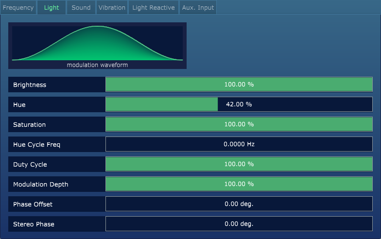
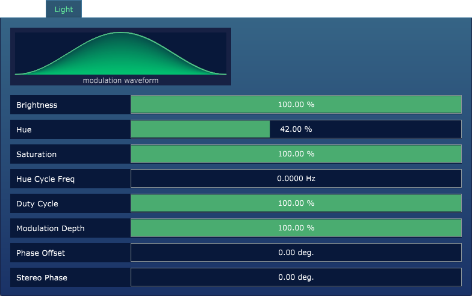
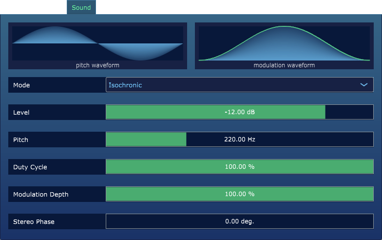
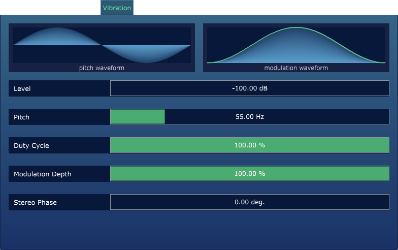

### Editor Overview

The Editor Screen houses the all editable Parameters with Prism (these are also exposed as Automation Parameters within the DAW).
The example below has the Light tab selected, revealing all the editable parameters relevant to light output.

---

### Editor Basics

There are a couple of basic concepts which drive Parameter editing within Prism:

**Waveform Selection**

There are various sections within the Editor that provide a configurable Waveform (for either driving "Modulation" or "Pitch" for a particular set of parameters).

The Waveform can be changed by clicking on the image and selecting a different source Waveform.

**Parameter Editing**

Individual parameters all follow the same structure (with either a Slider or Dropdown for changing the Value):

1. `Parameter Name` Displays the name of a given Parameter.
2. `Parameter Value` Displays the value assigned to the Parameter. The value can be changed by 
click-and-dragging the mouse on the slider, or by clicking once on the slider and entering a 
specific value with the keyboard. _**Note**: This value can also be driven by the related Automation Parameter within the DAW,
which will be reflected here._

---

### Frequency Parameters

The Frequency tab houses all editable Parameters for controlling the modulation frequency for Light, Sound and Vibration within Prism. The `Frequency` value can be set manually, or controlled in relation to the DAW tempo.

* `Frequency` Drives the length of each Waveform cycle, from 0-60 Hz. This is the value utilized when the Sync Mode is set to "Off".
* `Sync. Mode` Drives the synchronization mode (`Off`, `Divide Beat`, or `Multiply Beat`). When in the **Divide Beat** or **Multiply Beat** modes, the Frequency parameter value is driven automatically by the result calculated via the Sync Ratio.
* `Sync. Ratio` When **Divide Beat** or **Multiply Beat** sync mode is selected, this is the value by which the beat will be divided or multiplied, respectively.
_**Note**: For easily understandable calculations, it can be useful to use a tempo of 60 BPM or 120BPM within the DAW._

_**Note**: When a Sync Mode other than "Off" is selected, the upper table displays the DAW's current Tempo (in this case 120 BPM), 
as well as the resulting `Sync Interval` and `Sync Frequency`._

---

### Light Parameters

Brainwave Entrainment sessions that include light stimulus will modulate a light source at a desired entrainment frequency.
The Light tab houses all editable Parameters related to the Light Waveform.

**Light Output**

This group of Parameters configures the basic settings for light color and waveform modulation. 
By default the Hue/Saturation/Brightness mode (HSB) is enabled for color mixing, but you can change this to Red/Green/Blue (RGB) within the `Color Mode` dropdown in the [Settings](03-settings-screen.md) window.

The current mode for Light `Encoding` is also configurable via the plugin [Settings](03-settings-screen.md) window. This includes Lumasonic, SpectraStrobe, AudioStrobe, or Disabled (for audio-only use). By default, Lumasonic is used.
If you are working with Mindplace hardware (such as the Kasina), switch the encoding to `SpectraStrobe`.

* `Brightness` The brightness level value for the Waveform.
* `Hue` The hue level value for the Waveform.
* `Saturation` The saturation level value for the Waveform.
* `Hue Cycle Freq` The frequency to cycle through the entire Hue range for the Waveform (this can be utilized for easy animation effects).
* `Modulation Depth` Drives the modulation mix for the waveform (0% for no modulation / solid color, 100% for full modulation, driven by Frequency).
* `Phase Offset` Offsets the starting point of the Waveform (this is reflected in the Waveform Preview).
* `Stereo Phase` Drives the Left/Right stereo phase separation (0-360 degrees).

_**Note**: When configuring Prism for RGB light mixing within the Settings window, the Hue, Saturation, and Hue Cycle Freq parameters
will be replaced with Red, Green, and Blue for color mixing. Prism will save these parameter values separately, so you can switch back and forth
between modes and retain the last color set when you were working in a particular mode (see image below)._

* `Red` The **Red** level value for the Waveform.
* `Green` The **Green** level value for the Waveform.
* `Blue` The **Blue** level value for the Waveform.

---

### Sound Parameters

Brainwave Entrainment sessions that include audio stimulus will modulate an audio tone at a desired entrainment frequency.
The Sound tab houses all editable Parameters related to the sound output for Prism, which can be configured for either 
Isochronic or Binaural tones with the following parameter:

* `Mode` Drives the sound output mode (`Isochronic` or `Binaural`).

**Isochronic**

Isochronic uses an amplitude modulated pitch to create a rhythmic tone at the desired entrainment frequency. 
For isochronic tones, the master `Frequency` parameter (from the Frequency tab) drives the beat, while all other aspects 
of the tone are driven by the parameters below `Mode`.

* `Level` Drives the level of the tone output (in dB).
* `Pitch` Drives the pitch for the source Pitch Waveform.
* `Modulation Depth` Drives the modulation mix for the Modulation Waveform.
* `Stereo Phase` Drives the Left/Right stereo phase separation (0-360 degrees).

**Binaural**

Binaural uses two separate tones in each ear to create the perception of a modulated 3rd "beat frequency".
For binaural tones, the master `Frequency` parameter (from the Frequency tab) once again drives the desired entrainment frequency. 

The Modulation Depth is replaced with Stereo Spread in this mode, and the Modulation Waveform is removed.

* `Stereo Spread` Controls the stereo spread for the tone (0% for Monaural, 100% for Binaural).

---

### Vibration Parameters

Vibration can be used as an additional somatic entrainment source, and is intended to be used with transducers/subwoofers.
Essentially, it is a low frequency Isochronic tone.
The Vibration tab houses all editable Parameters related to the vibration channel output.

* `Level` Drives the level of the tone output (in dB).
* `Pitch` Drives the pitch for the source Pitch Waveform.
* `Modulation Depth` Drives the modulation mix for the Modulation Waveform.
* `Stereo Phase` Drives the Left/Right stereo phase separation (0-360 degrees).

---

### Aux Input Parameters

The Aux Input section houses all editable Parameters for utilizing an Audio Input channel (whether sourced from the
microphone or another waveform sample playing) to further modulate the light and audio signals.

A preview of the real-time input level (in dB) is displayed in the input monitor at the top left, and the **Peak** level
lines can be reset by clicking anywhere in the preview area.

* `Light Gain` Gain multiplier applied to the aux. input, for the resulting output light signal.
* `Light RMS` Amount of RMS averaging applied to the aux. input, for the resulting output light signal.
* `Light Mod. Mode` Configures light modulation source channels (`Averaged Mono` or `Stereo`).
* `Light Mod. Depth` Percentage mix the aux. input levels have on the resulting light modulation.
* `Audio Mod. Depth` Percentage mix the Frequency modulation has on the output audio.
* `Audio Stereo Phase` Left/Right stereo phase separation (0-360 degrees) for the modulated audio source.
* `Audio Output Gain` Gain multiplier applied to the resulting modulated audio output.