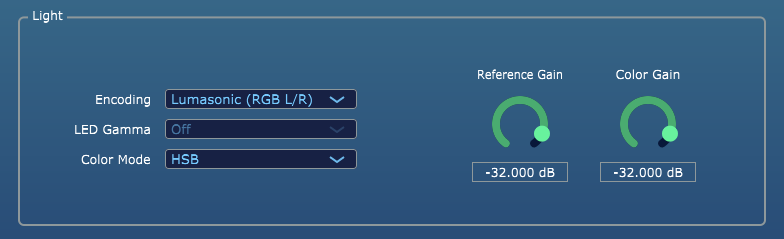
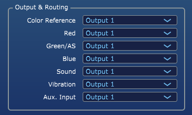
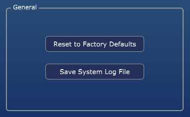

### Settings Overview

The Settings Screen houses all editable Global Settings for Prism. These are applied _per instance_ of the plug-in, allowing for the stacking of effects when using multiple instances of Prism on different MIDI tracks within the DAW.

---

### Light Settings

The Light encoding can be configured for Lumasonic (_default_), SpectraStrobe, AudioStrobe, or Disabled (audio-only) output.

* `Encoding` Controls the output encoding for the Light signals (Disabled, Lumasonic, SpectraStrobe, AudioStrobe).
* `LED Gamma` Adjusts the LED brightness Gamma Correction Curve, which for the SpectraStrobe mode can help align the expected output with the perceived levels in LED glasses.
* `Color Mode` Controls the color mixing mode (Hue/Saturation/Brightness or Red/Green/Blue).
* `Reference Gain` dB Output Level for the Lumasonic or SpectraStrobe Reference Tone.
* `Color Gain` dB Output Level for the Color Tones.

---

### Output Routing Settings

The Output Routing section allows for configuring each signal source from Prism to be routed to a separate (or shared) output bus.
Each signal source can also be disabled entirely, as an option.

There are 6 stereo output buses available, the default is `Output 1`. Compatible DAWs can access and route the
output buses to their own audio/mixer track for fine-grained mixing control.

* `Color Reference` Audio bus routing for the color Reference Tone.
* `Red` Audio bus routing for the Red Tone.
* `Green/AS` Audio bus routing for the Green/AudioStrobe Tone.
* `Blue` Audio bus routing for the Blue Tone.
* `Sound` Audio bus routing for the Sound (Isochronic or Binaural) Tone.
* `Vibration` Audio bus routing for the Vibration Tone.
* `Aux. Input` Audio bus routing for the Aux. Input signal.

---

### General Settings

* `Reset to Factory Defaults` Resets all settings of this plug-in instance to their Factory Default values.
* `Save System Log File` Outputs a log file that can be saved and shared with Cymatic Somatics Support.

---

**[NEXT: sACN Module Overview](../03-Prism-VST/04-sacn-module-overview.md)**