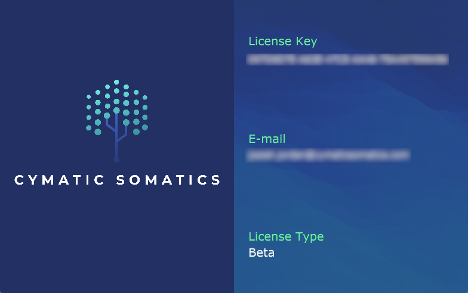

### License Information

The License Screen details information for the active Prism Studio license, including the `Licence Key` value, `Email` address, and `License Type`.

If no valid license is found (when Prism is installed but not activated via [Prism Product Manager](/docs/prism-product-manager)), the Activation screen will be displayed instead:

