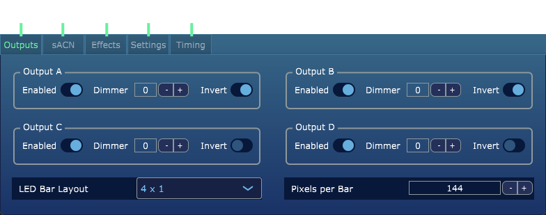

### Introduction

The `sACN Module` button displays a dialog that enables output configuration for the light encoding signal to drive external LED strips.

One lighting controller option is the [Advatek PixLite E-4S Mk3](https://www.advateklighting.com/products/e4-s-mk3). We will provide
additional documentation at a later time for the recommended configuration of this controller, in order to best use this feature.

---

### Activation

---

The sACN Module is accessible via a dedicated button within the top toolbar of the Prism VST and Prism Monitor plug-ins, as illustrated below.

**Prism VST** 

**Prism Monitor** 

---

### Interface Overview

The interface is composed of the following elements:

1. `Outputs Screen` Controls all settings related to the 4 pixel output channels (A-D).
2. `sACN Screen` Controls all settings related to the sACN lighting controller configuration.
3. `Effects Screen` Controls all settings for animation effects on the pixel strips.
4. `Settings Screen` Controls high level settings for the plug-in instance.
5. `Timing Screen` Displays the current timing performance data for monitoring and debugging.

---

### Usage

The sACN Module should be configured to match the desired settings within the Lumasonic Lighting Controller MK1,
taking into account the pixel strips being utilized (in particular 8-bit vs 16-bit). The settings to configure are:

---

#### Outputs Screen

* `Output A-D` Controls the `Enabled` state, `Dimmer` value, and `Invert` state for Output A-D on the Lumasonic Lighting Controller MK1.   _**Note**: The Invert setting allows for flexible physical layouts of the LED bars, where L/R is relative to user's orientation._
* `LED Bar Layout` Controls the layout of the output signal, and must be matched to the physical layout being utilized:
    * 1x1: Single LED bar
    * 1x2: Single LED bar, split in the middle for any stereo effects
    * 2x1: Two LED bars, with each bar acting as one channel (L/R) for any stereo effects
    * 2x2: Two LED bars, with each pair acting as a unified channel (L/R) for any stereo effects
    * 4x1: Four LED bars, with same signal duplicated to each one
* `Pixels per Bar` Controls the number of pixel data points generated for each Output, and should be matched to the physical number of LEDs on the pixel strips in use.

---

#### sACN Screen

* `Network Interface` Controls the network interface IP to target for the output data packets. This should match the IP of the Lumasonic Lighting Controller MK1 on your local network.
* `Color Encoding` Controls the encoding for the output data packets, and should match the actual LED configuration in use within the Lumasonic Lighting Controller MK1: `RGB 8 Bit`, `RGBW 8 Bit`, or `RGB 16 Bit`.
* `sACN Priority` Sets the sACN network priority for the output data packets.
* `Start Univerise` Sets the starting universe for the output data packets.
* `End Universe` Displays the calculated end universe for the output data packets, calculated based on the start.
* `End Channel` Displays the end channel for monitoring purposes
* `Source Name` Displays the encoded source name to help with sACN monitoring
* `Packets Sent` Displays the packets sent over the network, to help with monitoring and debugging

---

#### Effects Screen

* `Pixel Frame Decay` Controls the frame decay (in seconds) for animated pixels.
* `Pixel Update Mode` Controls the pixel update / animation mode.
    * `Forward Fill`: Fill the pixel strip starting from the first pixel (closest to the input cable connection)
    * `Backward Fill`: Fill the pixel strip starting from the last pixel (furthest from the input cable connection)
    * `Ping Pong Fill`: Ping Pong back and forth for the whole pixel strip for each Frequency cycle
    * `Stereo Color`: Fill all pixels simultaneously (the default mode)

---

#### Settings Screen

* `Thread Mode` Controls the threading implementation:
    * `Safe`: Least aggressive performance. Unless any glitching is visible, this is a good default option.
    * `Efficient`: Balance between performance and safe. This becomes especially noticeable in frequencies near 40Hz, and will produce a more stable signal.
    * `Performance`: Most CPU-intensive option, but should guarantee no glitches are visible at very high frequencies.
* `Limit Frame Rate` Controls whether or not the framerate will be capped to the ideal value based on sample size.

---

#### Timing Screen

* `Network Update Timing` Displays the network thread timing for monitoring/debugging purposes.
* `sACN Output Timing` Displays the sACN output timing for monitoring/debugging purposes.

---

**[NEXT: About Screen](../03-Prism-VST/05-about-screen.md)**