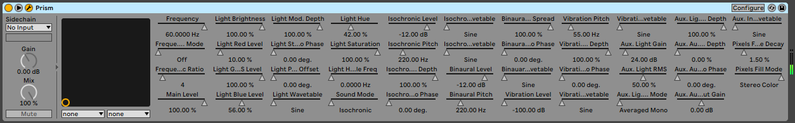
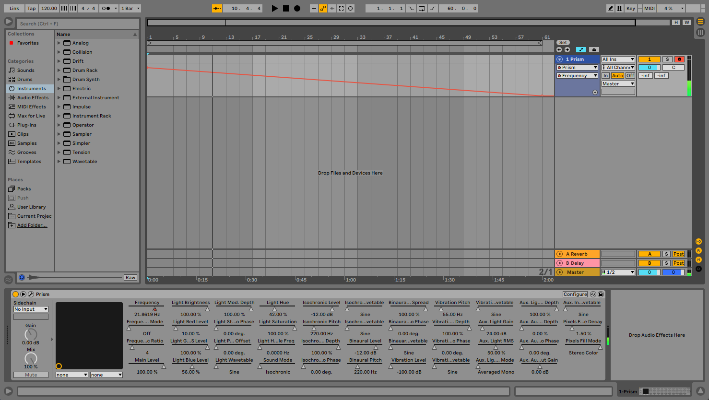

### Automation

Prism VST can be controlled within your DAW via Parameter Automation.

Every automatable Parameter within Prism is exposed to the DAW, as illustrated with Ableton Live, below.

One example use case would be creating a `Frequency` ramp using the associated Automation Parameter, as illustrated below 
with a ramp that moves from **40Hz** to **0Hz** over the span of the composition.

---

### MIDI CC Automation

All exposed Prism VST Automation Parameters can of course be controlled live via MIDI CC mapping within your DAW. In the 
following example, the MIDI CC `PitchBend` is mapped to `Light Mod. Depth` within Ableton Live:

