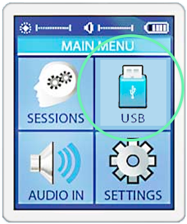

### Publishing Content

Lumasonic content publishing should follow the same standards set out with SpectraStrobe publishing below, and is
meant to be played back on Lumasonic-supported players and hardware. This is currently reserved for our B2B solution.
Please get in touch if you are interested in licensing our roomscale solution.

Otherwise, the most common publishing pathway will be SpectraStrobe, for the Mindplace Kasina and Limina hardware.

For an overview of the SpectraStrobe format itself, please see our [SpectraStrobe Documentation](../09-SpectraStrobe/01-spectrastrobe-introduction.md).

When working with the Mindplace Kasina, the device must be properly configured first by following the steps outlined in the 
[Kasina Documentation](08-kasina.md).

Prism-created compositions can be played on the Kasina by rendering to WAV or MP3, and copied to the Kasina. 
Alternatively, compositions can be monitored live on the hardware (while using Prism VST) via the **USB** or **Aux In** 
methods outlined below. 

---

### WAV Encoding

It is recommended to render an uncompressed **.wav** file as your master track. Each DAW will have slightly different
render-to-file configurations, but always prefer the following settings:
* 48000 Hz sample rate
* 16 bit, signed PCM sample format
* Dithering disabled
* When putting WAV files directly on the Kasina, avoid Wave64 format (unsupported by Kasina)

The following is a list of preferred WAV file export settings for various DAWs:

#### Ableton

#### Reaper

_**Note:** Set **Format** to `WAV` and set **Large files** to `Force WAV` for Kasina compatible-output._

#### Tracktion Waveform

_**Note:** Waveform always exports WAV files to Wave64 format which the Kasina does not directly support. Files
can be re-exported to WAV through a program like Audacity to work around this issue. Otherwise, encode to
MP3 format to deploy content._

`WAV` files that won't play on the Kasina can usually be fixed by opening them and re-exporting in Audacity:

---

### MP3 Encoding

Although different MP3 encoding settings and software will work, always prefer the following settings:

* 48000 Hz sample rate
* 16 bit, signed PCM sample format
* 320 Kbps, constant bitrate
* Prefer `Stereo` instead of `Join Stereo` encoding

You can download free audio software like [Audacity](https://www.audacityteam.org/) to encode your
WAV file renders to MP3 before deploying them to the Kasina's microSD card.

If other MP3 encoding software produces mixed results, use the following Audacity MP3 export settings
as a baseline.

First open the `WAV` file in Audacity. Next, export the WAV files as an `MP3`:

Configure export with the following settings:
* `Bit Rate Mode` Constant
* `Quality` 320 Kbps
* `Channel Mode` Stereo

Optionally, add or clear MP3 file metadata on export:

---

### Live Play with Prism (USB)

One way to output SpectraStrobe audio from your DAW to the Kasina is via USB:

1. Power on the Kasina and connect your desired glasses.
   
2. Select the `USB` mode using the **Navigation Wheel** (the USB cable must be plugged into a computer before USB mode 
can be selected). You can exit USB mode at any time by pressing **LEFT** on the **Navigation Wheel**.
   

3. Your Kasina should now be treated as a valid audio device within your OS. Within your DAW Preferences/Settings, choose 
the KASINA as your Audio Ouput device. Examples in Ableton Live, Reaper, and Waveform are provided below. _**Note**: 
Experiment with the specific audio driver (DirectSound, DirectX, WindowsAudio, etc.) to find the ideal output quality 
and latency._

4. Arm Prism VST/AU for recording on any track within your DAW and Preview using the Play button. You should now see the equivalent 
output in your Kasina glasses.

---

### Live Play with Prism (Aux In)

Alternatively, your Prism VST/AU compositions can be monitored live via the Aux Input on the Kasina:

1. Power on the Kasina and connect an audio cable from your computer's available output ports (either the **Headphones** 
jack or an audio interface output) to the `Aux Input` of the Kasina.

2. Connect your desired LED glasses.

3. Select the `AUDIO IN` mode (or `AUX AUDIO` on some devices) using the **Navigation Wheel**.
   

4. Set your OS audio output accordingly and set the System Volume to 100%. _**Note**: Be sure to disable any installed 
audio EQ software, which is often loaded by default on gaming computers._

5. Arm Prism for recording on any track within your DAW and Preview using the Play button. You should now see the equivalent 
output in your Kasina glasses. _**Note**: Sometimes the `AUDIO IN` mode doesn't initiate properly on the first attempt of 
selecting it within the Kasina interface. If this happens, simply click **LEFT** on the **Navigation Wheel** to exit the 
mode, and then re-select it._