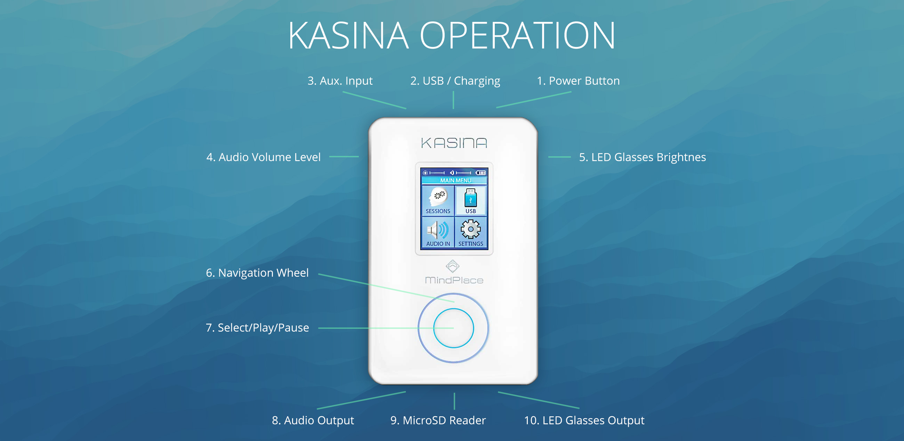
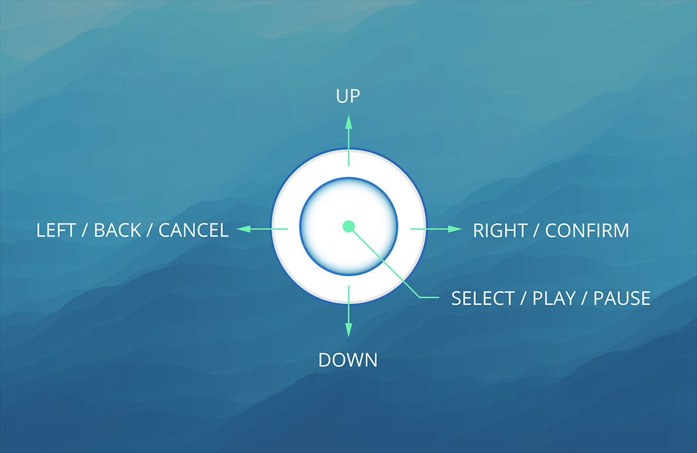
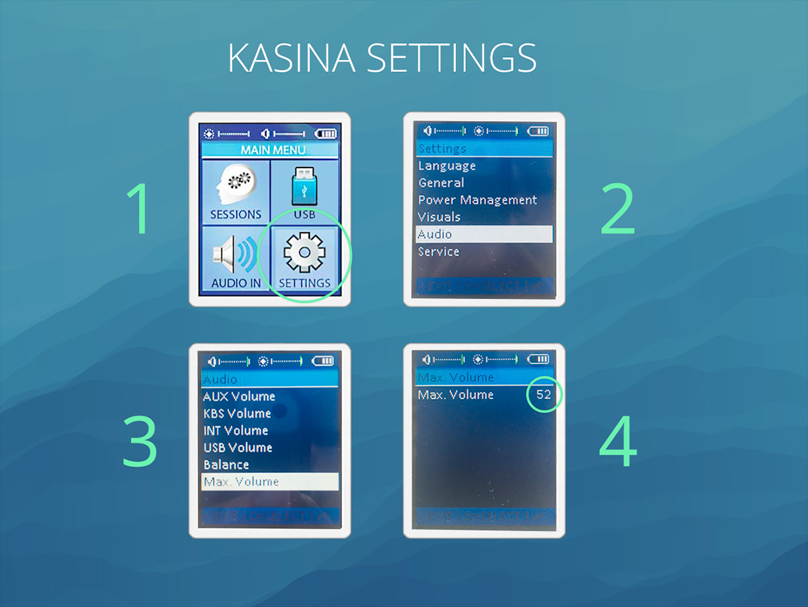
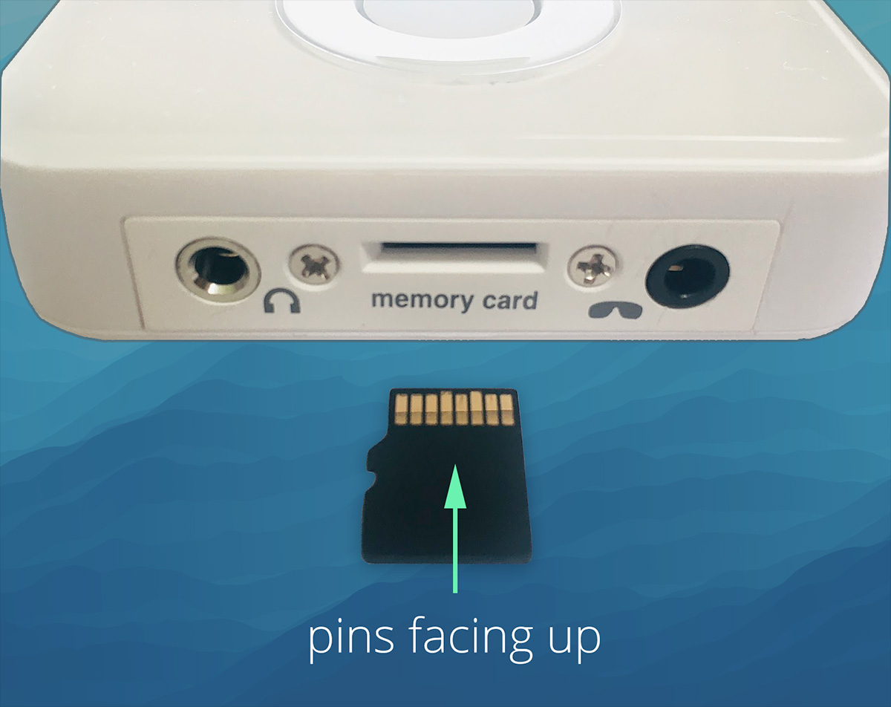
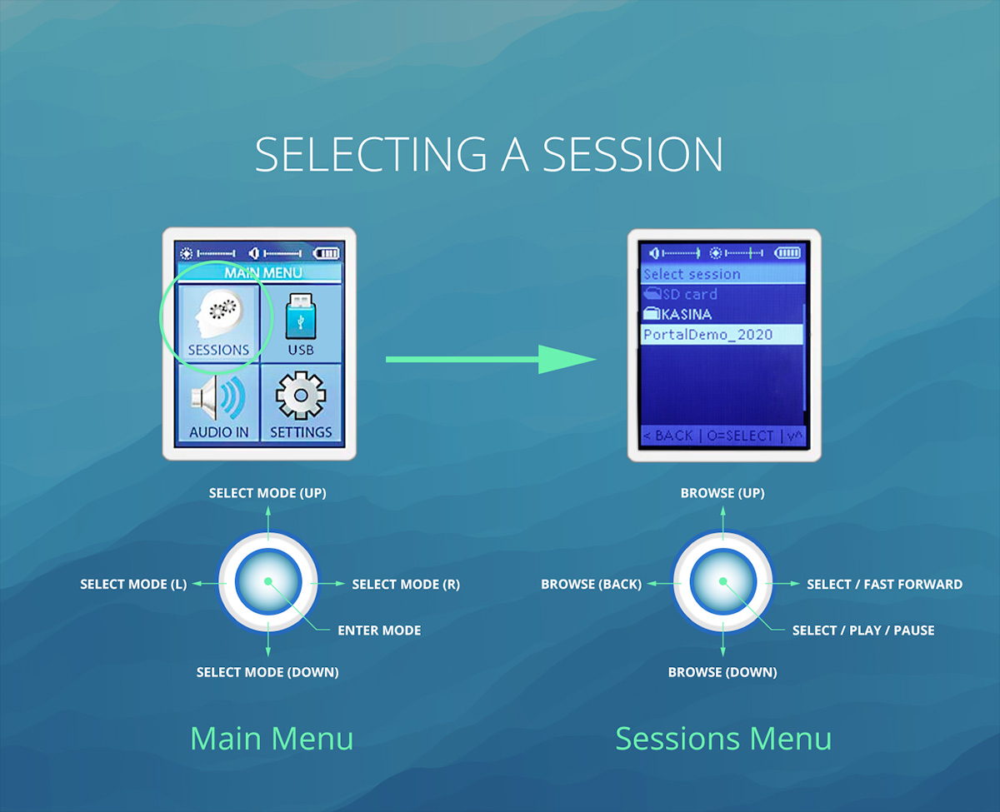
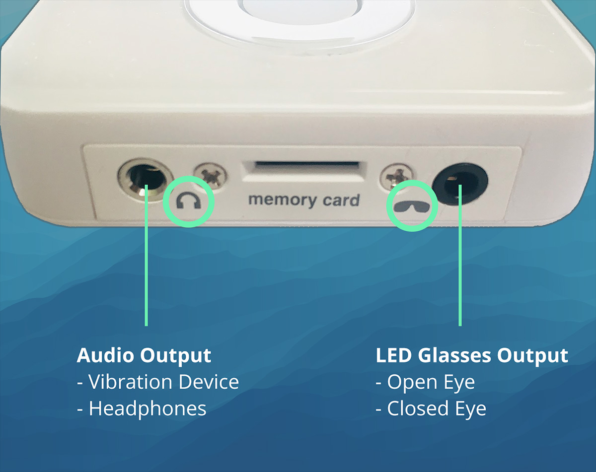

### Basics

The Kasina light & sound player controls session selection and playback. Its audio output provides the headphone & vibration signals, and the LED glasses output controls the visual signals of the LED glasses.

---

### Controls

1. `Power Button` Press and hold button to power on and off
2. `USB / Charging` Battery charging via USB cable; optional data & audio mode
3. `Aux. Input` 3.5 mm auxiliary audio input (external streaming input)
4. `Audio Volume Level` Adjusts Kasina's audio level (audio only)
5. `LED Glasses Brightness` Adjusts Kasina's LED level (LEDs only)
6. `Navigation Wheel` Selection: UP, DOWN, RIGHT (confirm), LEFT (back)
7. `Select/Play/Pause` Plays/pauses content or selects a menu option
8. `Audio Output` 3.5 mm audio output (sound & vibration out)
9. `MicroSD Reader` Stores content files
10. `LED Glasses Output` 3.5 mm LED glasses output (4 conductor TRRS)

___

### General Operation

* To power the unit on and off, press and hold the **(1) Power Button** for several seconds. If
  the unit doesn't power on, make sure it is plugged into a USB power source first for charging.

* **(4) Audio Volume** and **(5) LED Brightness** can be adjusted independently using the controls on the left and right side of the Kasina

* Once turned on, the Kasina will display its Main Menu choices: **SESSIONS**, **USB**, **AUDIO IN**, **SETTINGS**.

* The **(6) Navigation Wheel** can be used to navigate the menu screens by pressing: **UP**, **DOWN**, **RIGHT**, **LEFT** or to select menu choices.
  The circular **(7) Select/Play/Pause** button selects the current menu item. **RIGHT** = back/cancel, **LEFT** = forward/confirm.
  

___

### Required Settings

When the Kasina is new, it must have factory settings changed in preparation for ideal playback of Prism multi-sensory content.

1. Select `SETTINGS` from the Main Menu
2. Select `Audio` from the Settings Menu
3. Navigate to `Audio` → `Max. Volume`
4. Click `UP` until `Max. Volume` is set to `52`
5. Click the Kasina's **(7) Select/Play/Pause** button to save the change

Exit **SETTINGS** by repeatedly clicking **LEFT** until back in the Main Menu, or simply powering down the Kasina by holding the **(1) Power Button**.

___

### Optional Settings
* Power Management → Display Off Timeout = **Never off** - (do not turn off the screen during a session)
* Power Management → Device Off Timeout = **Never off** - (do not turn off device after a period of no use)
* General → Play Countdown - (change or turn off the countdown after pressing play)

___

### Micro-SD Card

For bounced/rendered sessions, the best way to transfer them to the Kasina is via the Micro-SD Card.

* To insert a card, **make sure its pins are facing up (towards the screen)**, and insert it into the **(9) MicroSD Reader** until
  the card clicks securely into place.

* To remove the card, use your finger nail and press in on the **MicroSD card** in the **(9) MicroSD Reader** until
  the card inside clicks and releases outward.

* The Kasina plays content in the form of either **.wav** or **.mp3** files loaded onto its **MicroSD card**.
  Cymatic Somatics content files have been created specifically to work with the Kasina. The **(9) MicroSD Reader**
  is accessed at the bottom of the unit. Folders are supported. 
  

___

### Selecting a Session

* With the **SESSIONS** menu item selected in the menu screen, click the **(7) Select/Play/Pause** button to
  select **SESSIONS** mode.

* Once in **SESSIONS** mode, use the **(6) Navigation Wheel** to browse content on the **MicroSD card**.

* With a file on the **MicroSD card** selected, press the **(7) Select/Play/Pause** button to play the file
  (press again to play/pause the track). Hold **RIGHT** on the **(6) Navigation Wheel** to fast-forward.
  Press **LEFT** on the **(6) Navigation Wheel** to go back or cancel.
  

___

### Ouputs

* The **(8) Audio Output** should be connected to the vibration device's audio input with a stereo 3.5 mm
  auxiliary audio cable. Connect this directly to **Headphones** instead if no vibration device is used.

* The **(10) LED Glasses Output** should be connected to the **LED Glasses** via their attached 3.5 mm TRRS cable.
  