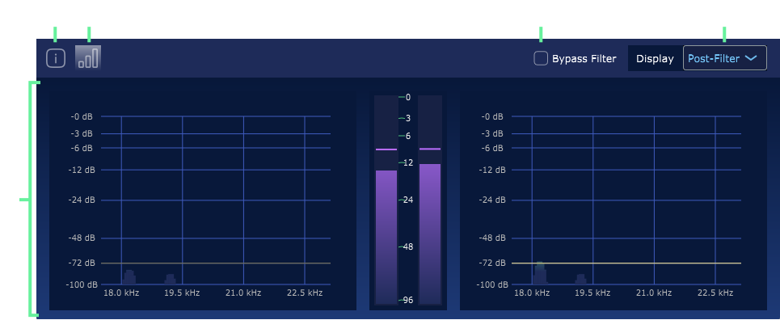

### Introduction

Prism Audio Bus is a VST plugin installed with Prism Studio. 

When using an audio-visual codec like `Lumasonic`, `SpectraStrobe`, or `AudioStrobe`, it is necessary to filter out frequencies at `18 kHz` (and above)
from the underlying stereo audio mix, which is used to encode the visual signals
as audio.

`Prism Audio Bus` has two main features when creating content for these codecs:
1. Applies a special filter to the audible portions of the stereo audio
track it is on to prevent interference with the visual encoding frequency range
2. Provides direct visual feedback of the levels in each frequency band
used by the selected codec, including a target level threshold and live threshold trigger indicator

---

### Interface

The interface is composed of the following elements:

 

1. `About Screen` Displays info about the Prism Audio Bus version.
2. `Monitoring Screen` Displays the current input and output for Prism Audio Bus.
3. `Bypass Filter` Disables the filter and displays the resulting unfiltered output.
    
4. `Display` Enables Post-Filter and Pre-Filter display selection, with Pre-Filter revealing the original signal (whether or not Bypass Filter is selected):
    
5. `Audio Meters` Displays realtime signal for resulting output, with axis values for the Lumasonic Reference, Red, Green, and Blue frequencies. The different frequencies of SpectraStrobe and AudioStrobe signals can be inferred as well, though the axis values do not change.

---

### Usage
_**Note:** The Prism Audio Bus plug-in instance should be placed at the end of your master audio track's list of effects, 
in order to filter out any unwanted frequencies that would otherwise interfere with Prism's light encoding._

#### Basic
You can put an instance of `Prism Audio Bus` on any audio track in your
DAW that is part of the audible portion of your mix (i.e. non-visual, music, vocals, atmosphere, or audio effects, etc).
This will ensure that all  audible portions of your project are properly equalized so that they won't interfere
with the visual signals encoded as `LumaSonic`, `SpectraStrobe`, or `AudioStrobe` in your final mix.

#### Advanced
The most efficient way to use `Prism Audio Bus` is to create an `audible-audio mix track`
in your DAW. Use it to merge all other audible tracks into a single final audible 
track. Place a single instance of `Prism Audio Bus` on this track and route all other
audible-audio tracks into it (rather than to your master track). 

Finally, route
the `audible-audio mix track` to the mix's master track/output. Using a single
plug-in instance is more CPU efficient and requires less track management.

_**Note:** Refer to the user manual of your DAW for how to route audio signals between tracks, because it is DAW-specific functionality._

---

**[NEXT: Prism Monitor](../05-Prism-Monitor/01-prism-monitor-overview.md)**