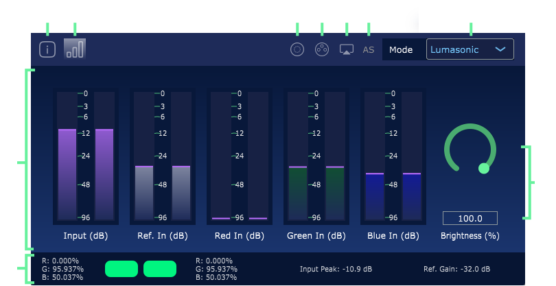

### Introduction

`Prism Monitor` is a VST plugin installed with Prism Studio. It is designed to provide insight into your audio mix with respect to the `Lumasonic`, `SpectraStrobe`, or `AudioStrobe` signals.

_**Note:** `Prism Monitor` utilizes Cymatic Somatic's own decoder technology that provides accurate decoding of our own format (`Lumasonic`), while providing a close approximation for `SpectraStrobe`, which has a proprietary decoder._

`Prism Monitor` will still provide insights for `SpectraStrobe` (such as audio bleeding into these signals within the mix), but the resulting output will not be perfectly accurate.

For the `Lumasonic` codec, the decoding is accurate and the signal is cleaner.

---

### Interface

The interface is composed of the following elements:

1. `About Screen` Displays info about Prism Monitor and **Cymatic Somatics Inc**.
2. `Monitoring Screen` Displays the current levels of all monitored signals.
3. `Licensing Screen` Displays the licensing information.
4. `Preview Window` Opens a high-framerate resizable preview window with stereo color output for the decoded signal. The resulting framerate will be capped by the monitor or tv it is presented on. _**Note:** This is only available while decoding Lumasonic or AudioStrobe signals._
    
5. `AudioStrobe Detection` Highlights green when no reference tone has been detected, indicating an AudioStrobe signal:
     
6. `Mode Select` Allows selection of Lumasonic or SpectraStrobe for the decoded output.
     
    _**Note:** You will need to ensure that Prism VST is outputting the same signal you select to monitor here. See the Prism VST documentation for Light Encoding [Settings](/docs/prism-settings-screen)._
7. `Audio Meters` Displays realtime signal for decoded output, with audio meters for resulting dB of overall Input signal as well as Reference, Red, Green, and Blue signals, in dB. 
8. `Realtime Output Details` Provides detailed information for decoded signal, with a color stereo preview. _**Note:** Color preview only available while decoding Lumasonic or AudioStrobe signals._
9. `Brightness` Controls the overall brightness for the decoded signal (as seen on the OpenGL preview screen or sACN output).

---

### Usage
Prism Monitor can be used anywhere where you would like to check the signal integrity of your Lumasonic, SpectraStrobe, or AudioStrobe composition.
It will help troubleshoot issues where there appear to be visual anomalies in the signal when playing back on hardware such as the MindPlace Kasina.

At a minimum, it is ideally placed on the Master track in your DAW. This will provide an overview of the signal as it stands just before rendering the final output.

_**Note:** For Prism Monitor to work properly, be sure to keep Mode parity between Prism VST and Prism Monitor._

