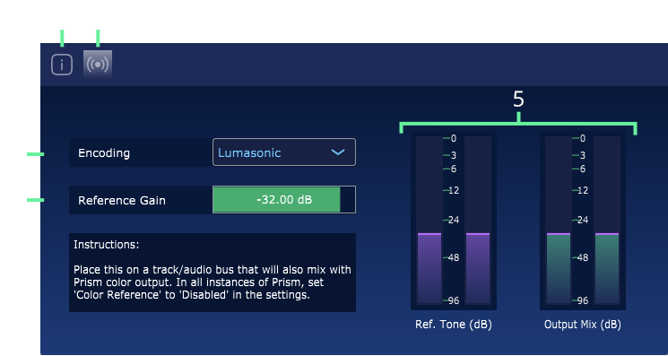

### Introduction

`Prism Reference` is a VST plugin installed with Prism Studio. It is designed to create a Reference Tone for `Lumasonic` or `SpectraStrobe` encoding, in 
place of the Reference Tone generated by Prism VST. 

---

### Interface

The interface is composed of the following elements:

1. `About Screen` Displays info about Prism Reference and **Cymatic Somatics Inc**.
2. `Encoding Screen` Displays the Reference Tone encoding settings.
3. `Licensing Screen` Displays the licensing information.
4. `Encoding Mode` Controls the output encoding: `Disabled`, `Lumasonic`, or `SpectraStrobe`.
5. `Reference Gain` dB Output Level for the Lumasonic or SpectraStrobe Reference Tone.
6. `Audio Meters` Displays realtime audio meters for resulting dB of Reference Tone and Output Mix signals.

---

### Usage
Prism Reference is useful when you want to stack multiple instances of Prism, in which case all but one instance should normally have the Reference Tone enabled.

This plug-in enables an alternate workflow, where Prism Reference can be applied to the master light encoding track while all Prism instances can simply
disable their Reference Tone generation. This avoids the situation where one must hunt down WHICH instance of Prism is producing the tone.

This plug-in is simply provided as a workflow convenience, and is not necessary if Prism is used to create the Reference Tone.