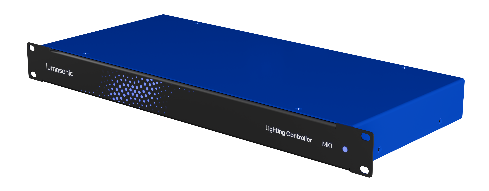
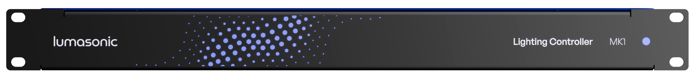
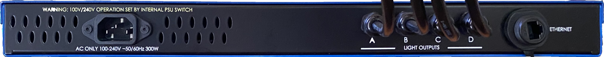
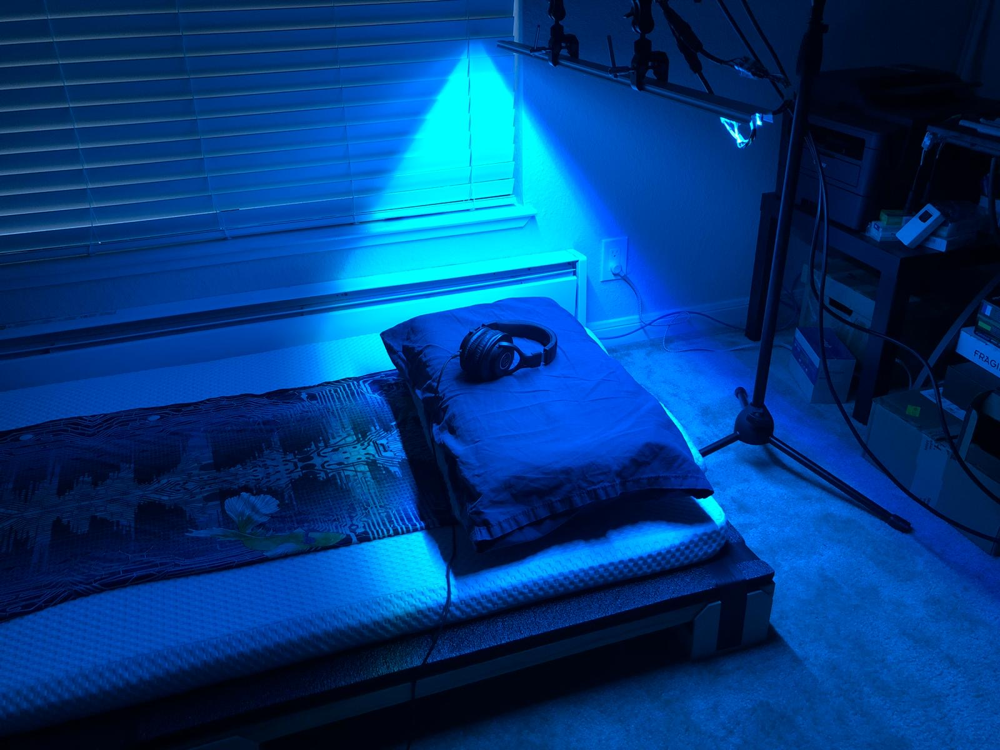
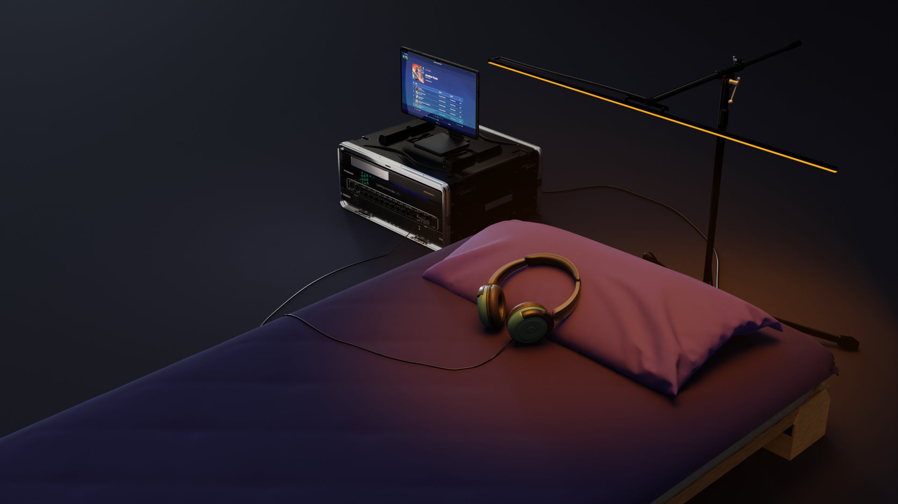

### Introduction

`Lumasonic` is our high performance codec for encoding light and sound signals simultaneously into a general 
stereo audio signal. Much like `AudioStrobe` and `SpectraStrobe`, we utilize specific frequency bands in the audio
signal to encode control signal values that can then drive RGB LEDs.

We have optimized `Lumasonic` for performance and signal quality, and have built it in a way that allows us to expand
beyond the typical 3 stereo signals (RGB Left/Right). This opens up the possibility to encode much more information in
the audio signal, which could be used to drive any other aspect of a multisensory experience, beyond light control.

The codec is extremely lightweight and embeddable, and intended to enable a growing ecosystem of multisensory and 
neural entrainment hardware.

Below is an example use case for hardware designed to deliver Lumasonic experiences. We may in the future
release the CAD files and reference design for the lighting controller (or at least some basic guidance for using the 
sACN functionality within [PrismVST](../03-Prism-VST/01-prism-plugin-overview.md) and [PrismMonitor](../05-Prism-Monitor/01-prism-monitor-overview.md) 
with off-the-shelf hardware).

---

### Hardware

The `Lumasonic` codec is the cornerstone of our own high-fidelity hardware, purpose built for delivering peak
multisensory experiences, with content creation enabled via [Prism Studio](../02-Prism-Studio/01-introduction.md) tools.

Below is an overview of the current hardware ecosystem that has been built out as a prototype implementation. The CAD
files and build instructions will eventually be included in this repo if you'd like to build your own kit.

#### Lighting Controller MK1

The Lighting Controller MK1 is a custom built 1U rack enclosure that houses everything needed to drive up to 4 LED bars 
via Ethernet using Lumasonic Media Server or Prism Studio tools.

##### Features

* 1U Aluminum rack enclosure
* Protects equipment and conforms to standard 19” rack sizing
* 100-240V operation via internal toggle switch
* Rear panel ports for AC power and Ethernet cable
* Rear panel has 4 lighting bar output cables with cable glands/strain relief
* Can be used as a generic ArtNet/sACN/DMX lighting controller

#### High FPS LED Bars w/ Full Color RGB
We use the lighting controller to drive Up to 4x synchronized 8-bit or 16-bit LED bars w/ stands, for exquisite 
visuals capable of delivering shared experiences.

#### Lumasonic Media Server

The Lumasonic Media Server is a turnkey solution for running up to 4 synchronized multisensory (light/sound/vibration)
stations. It is composed of:

* Lumasonic Lighting Controller MK1
* mac mini
* Behringer UMC1820 Audio Interface
* Furman Power Supply
* 2K Touchscreen

Combine the Lumasonic Media Server with a vibroacoustic solution such as the [Crescendo Research](https://www.crescendoresearch.com/) 
daybed or bass tiles for a truly transportive experience.

