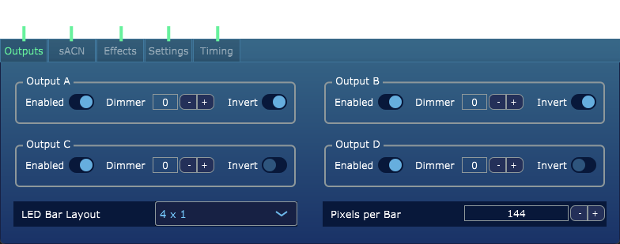
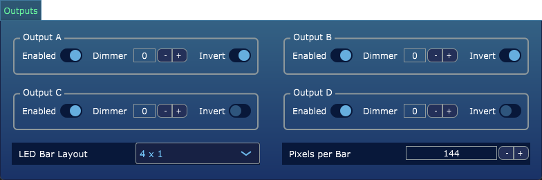
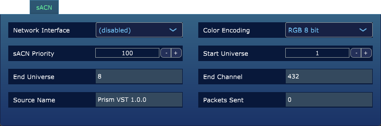
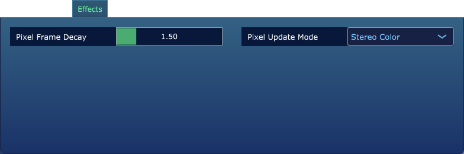
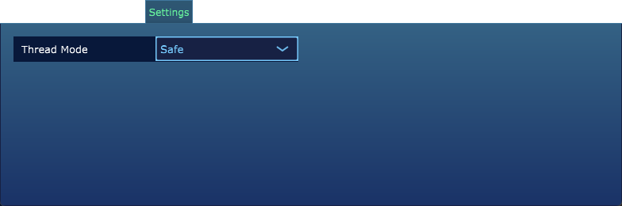
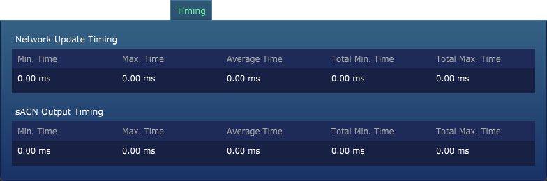

### Introduction

The `sACN Module` is an add-on module for Prism and Prism Monitor that is licensable for B2B enterprise customers.
It enables output for the light encoding signal to external LED strips, as part of the Lumasonic Media Server.

---

### Activation

---

The sACN Module must be activated with Prism Product Manager, after which it will be accessible via a new button within the top toolbar
of the Prism VST and Prism Monitor plug-ins, as illustrated below.

**Prism VST** 

**Prism Monitor** 

---

### Interface Overview

The interface is composed of the following elements:

1. `Outputs Screen` Controls all settings related to the 4 pixel output channels (A-D).
2. `sACN Screen` Controls all settings related to the sACN lighting controller configuration.
3. `Effects Screen` Controls all settings for animation effects on the pixel strips.
4. `Settings Screen` Controls high level settings for the plug-in instance.
5. `Timing Screen` Displays the current timing performance data for monitoring and debugging.

---

### Usage

The sACN Module should be configured to match the desired settings within the Lumasonic Lighting Controller MK1, 
taking into account the pixel strips being utilized (in particular 8-bit vs 16-bit). The settings to configure are:

---

#### Outputs Screen

* `Output A-D` Controls the `Enabled` state, `Dimmer` value, and `Invert` state for Output A-D on the Lumasonic Lighting Controller MK1.   _**Note**: The Invert setting allows for flexible physical layouts of the LED bars, where L/R is relative to user's orientation._
* `LED Bar Layout` Controls the layout of the output signal, and must be matched to the physical layout being utilized:
  * 1x1: Single LED bar
  * 1x2: Single LED bar, split in the middle for any stereo effects
  * 2x1: Two LED bars, with each bar acting as one channel (L/R) for any stereo effects
  * 2x2: Two LED bars, with each pair acting as a unified channel (L/R) for any stereo effects
  * 4x1: Four LED bars, with same signal duplicated to each one
* `Pixels per Bar` Controls the number of pixel data points generated for each Output, and should be matched to the physical number of LEDs on the pixel strips in use.

---

#### sACN Screen

* `Network Interface` Controls the network interface IP to target for the output data packets. This should match the IP of the Lumasonic Lighting Controller MK1 on your local network.
* `Color Encoding` Controls the encoding for the output data packets, and should match the actual LED configuration in use within the Lumasonic Lighting Controller MK1: `RGB 8 Bit`, `RGBW 8 Bit`, or `RGB 16 Bit`.
* `sACN Priority` Sets the sACN network priority for the output data packets.
* `Start Univerise` Sets the starting universe for the output data packets.
* `End Universe` Displays the calculated end universe for the output data packets, calculated based on the start.
* `End Channel` Displays the end channel for monitoring purposes
* `Source Name` Displays the encoded source name to help with sACN monitoring
* `Packets Sent` Displays the packets sent over the network, to help with monitoring and debugging

---

#### Effects Screen

* `Pixel Frame Decay` Controls the frame decay (in seconds) for animated pixels.
* `Pixel Update Mode` Controls the pixel update / animation mode. 
  * `Forward Fill`: Fill the pixel strip starting from the first pixel (closest to the input cable connection)
  * `Backward Fill`: Fill the pixel strip starting from the last pixel (furthest from the input cable connection)
  * `Ping Pong Fill`: Ping Pong back and forth for the whole pixel strip for each Frequency cycle 
  * `Stereo Color`: Fill all pixels simultaneously (the default mode)

---

#### Settings Screen

* `Thread Mode` Controls the threading implementation: 
  * `Safe`: Least aggressive performance. Unless any glitching is visible, this is a good default option.
  * `Efficient`: Balance between performance and safe. This becomes especially noticeable in frequencies near 40Hz, and will produce a more stable signal.
  * `Performance`: Most CPU-intensive option, but should guarantee no glitches are visible at very high frequencies. 

---

#### Timing Screen

* `Network Update Timing` Displays the network thread timing for monitoring/debugging purposes.
* `sACN Output Timing` Displays the sACN output timing for monitoring/debugging purposes.