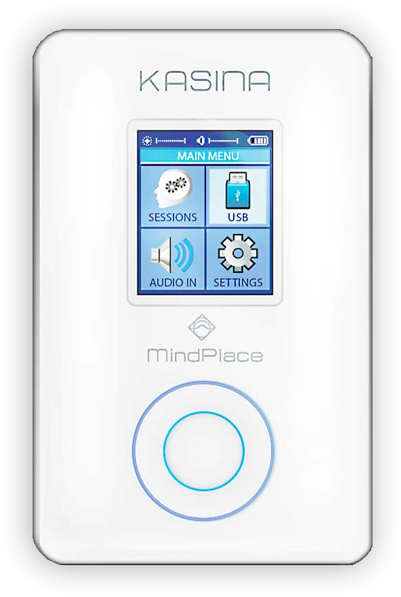
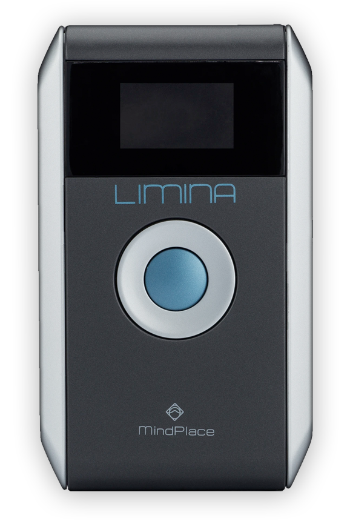
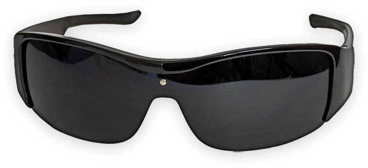
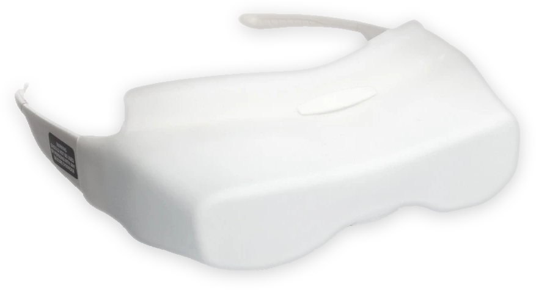

### Kasina
The MindPlace® Kasina is the most full-featured SpectraStrobe AVS device.

#### Notable Features:
* Playback of custom **SpectraStrobe & AudioStrobe** content as `MP3` and `WAV` files.
* Playback of **Kasina Basic Session Editor** `KBS` sessions
* Live **SpectraStrobe & AudioStrobe** decoding via `Aux Input` or `USB Audio Input`
* Content can be stored and transferred via `micoSD card`
* `Internal rechargeable battery` which can be charged via `USB cable` or `AC adapter`

---

### Limina
The MindPlace® Limina is a SpectraStrobe-capable AVS with a more modest feature set

#### Notable Features:
* Playback of **Kasina Basic Session Editor** `KBS` sessions
* Live **SpectraStrobe & AudioStrobe** decoding via `Aux Input` or `USB Audio Input`
* `Internal Storage` only
* Powered by two `AA batteries`

---

### LED Glasses
There two types of full color (RGB) LED glasses that will work with either the **Kasina** or **Limina**
* `Ganzframes` 
* `DeepVision™ Ganzframes`

These glasses differ across a few factors including **overall brightness**, **fit**, 
**color diffusion & reproduction**, and whether eyes are intended to be **closed** or left **open**
during operation.

---

### Ganzframes
| Eyes   | Color Difussion | Max. Brightness |
|--------|-----------------|-----------------|
| Closed | No              | Moderate        |

The standard style of LED glasses for the **Kasina** or **Limina**. The **red**,
**green**, and **blue** LEDs are fixed to the inside of the lenses and are intended to be
experienced through the eyelids with eyes closed.

**Pros:**
* Closed eye visuals produce a more intimate and internal experience
* Visuals are both more subtle and sharper at the same time
* Comfortable, lightweight design that resembles a pair of sunglasses

**Cons:**
* More limited color reproduction for some colors due to color diffusion through eyelids and
relatively wide spacing between LEDs
* In order to deal with undesirable brightness levels, user's must take glasses off, or 
physically adjust device brightness while in session.
* If users forget to close their eyes (or miss the instruction) then the open eye visuals are less pleasing and potentially too bright 

---

### DeepVision Ganzframes
| Eyes   | Color Difussion | Max. Brightness |
|--------|-----------------|-----------------|
| Opened | Yes             | High            |

The DeepVision™ glasses are slightly larger than the standard **Ganzframes** and produce bright, vivid
colors by mixing and diffusing the light from the **red**, **green**, and **blue** LEDs before
the light reaches your eyes. They are intended to be experienced with eyes open.

**Pros:**
* Open eye visuals produce a brighter and more saturating experiencing
* Color diffusion occurs in the glasses producing more accurate color reproduction over 
a wider range of color possibilities
* Users who experience brightness levels that cause discomfort can squint or close their eyes,
which has the effect of dimming the visuals, without external intervention
* Higher max. brightness (standard Ganzframes are bright enough for most, however) 

**Cons:**
* A slightly bulkier physical profile
* SpectraStrobe content can appear much brighter compared to the standard **Ganzframes**,
requiring the user to turn down comparable brightness levels when playing content on the **DeepVision** glasses