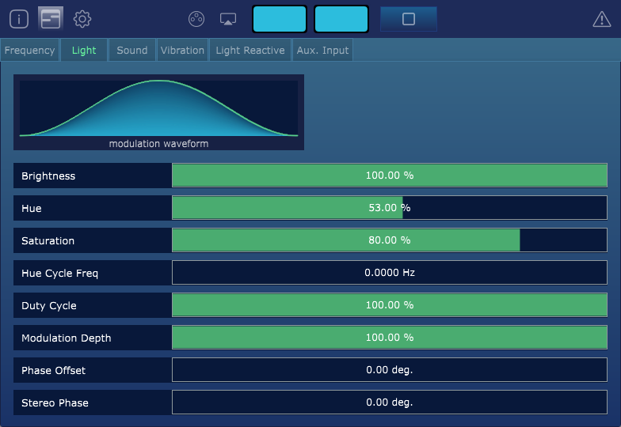
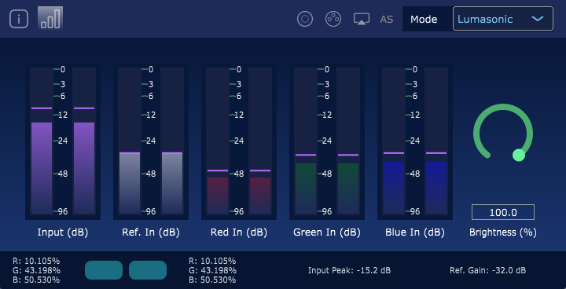
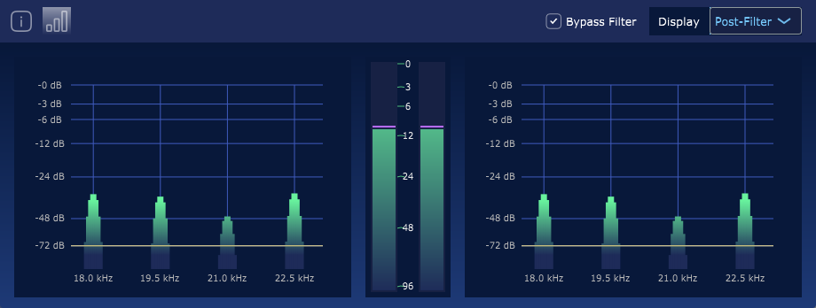
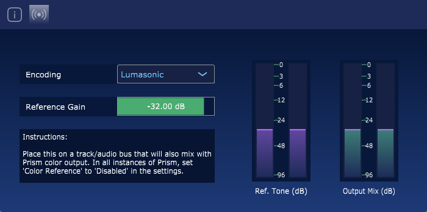

# Prism Studio Documentation
Prism Studio is an innovative cross-platform suite of VST3 audio plug-ins designed to precisely control light, sound, and vibration 
by encoding the lighting signals directly into sound. Using a unified workflow built around industry-standard audio technologies, 
creating and synchronising exquisite, high framerate multi-sensory content has never been easier.

Create content for off-the-shelf hardware or your build your own, with extensive device compatability supporting Lumasonic hardware, 
AudioStrobe and SpectraStrobe mind machines, and Raspberry Pi for custom integration or prototyping.

### Accessible and Inspiring
Spend more time in creative flow and less time troubleshooting complex audiovisual systems.

### Designed for Visionary Creators
Whether creating relaxing inner journeys, precise brainwave entrainment sessions, high framerate audiovisual art, or exploring the 
deep somatic benefits of adding vibration to light and sound, Prism Studio was designed for you.

### Powered by the Lumasonic Engine
A robust codec and portable playback engine designed to simplify the encoding and distribution of multi-sensory content via 
standard audio formats and live broadcast.

## Robust Suite of Tools

### Prism VST
Create compelling multi-sensory experiences with specially crafted software built upon DAW and VST3 plug-in standards.

* `Frequency Sync`: Globally synchronized frequency control for light, sound & vibration, with manual or tempo-based controls
* `Light Encoding`: Encode using modern standards for brainwave entrainment: Lumasonic, SpectraStrobe & AudioStrobe
* `Tone Generator`: Create frequency-synced tone layers using Isochronic, Binaural, and Monaural beats
* `Vibration`: Independent tone layer for somatic entrainment via vibration (for use with vibroacoustic hardware)
* `Light Reactive Modulation`: Create audio-reactive visuals by modulating the signal based on any audio source (such as a microphone or audio file)
* `Audio Input Modulation`: Modulate the incoming (side-chained) audio signal based on the current Frequency
* `Waveform Selector`: Choose between Sine, Saw, Triangle, Noise, and Pulse waveforms to modulate light, sound & vibration signals
* `Networked External Lighting`: Broadcast lighting signals over the network to off-the-shelf lighting controllers using the sACN protocol
* `High Framerate Preview` Preview the Prism light output via a resizable high-framerate window

### Prism Monitor
Remove the guesswork and ensure the perfect mix for your multi-sensory creations every time.

* `Lumasonic and AudioStrobe`: Monitor Lumasonic and AudioStrobe encoded signals in real-time
* `Live Preview`: Preview the color signal output, as well as detailed VU meters with dB level across all signal channels
* `Networked External Lighting`: Broadcast lighting signals over the network to off-the-shelf lighting controllers using the sACN protocol
* `Brightness Control`: Adjust the overall brightness of decoded content with a unified MIDI-mappable control for downstream lighting (such as sACN lighting controllers)
* `OpenGL Visualizer`: Utilize the extensible visualizer framework to create and run GLSL shaders that incorporate the decoded lighting signals, enabling
incredible full screen visuals that can be projected into a space or displayed on a screen to complement the pure light-based experience

### Prism Audio Bus
Add to your final audio bus to filter frequencies reserved for Lumasonic, SpectraStrobe and AudioStrobe from any audio track, ensuring a perfect final result.

* `Threshold Trigger`: Determine when audible frequencies begin to interfere with the encoded visual signals
* `Pre and Post-Filter Preview`: Preview the resulting signal before and after the filter has been applied, or bypass the filter entirely

### Prism Reference
Add your Lumasonic or SpectraStrobe reference tone to your final light bus rather than generating it within Prism VST. 
This is useful when working with multiple instances of Prism, where you want to avoid stacking reference signals.

## Ready to Get Started?

[Install Prism Studio](01-Installation/01-introduction.md) today to start exploring the world of multi-sensory content creation!