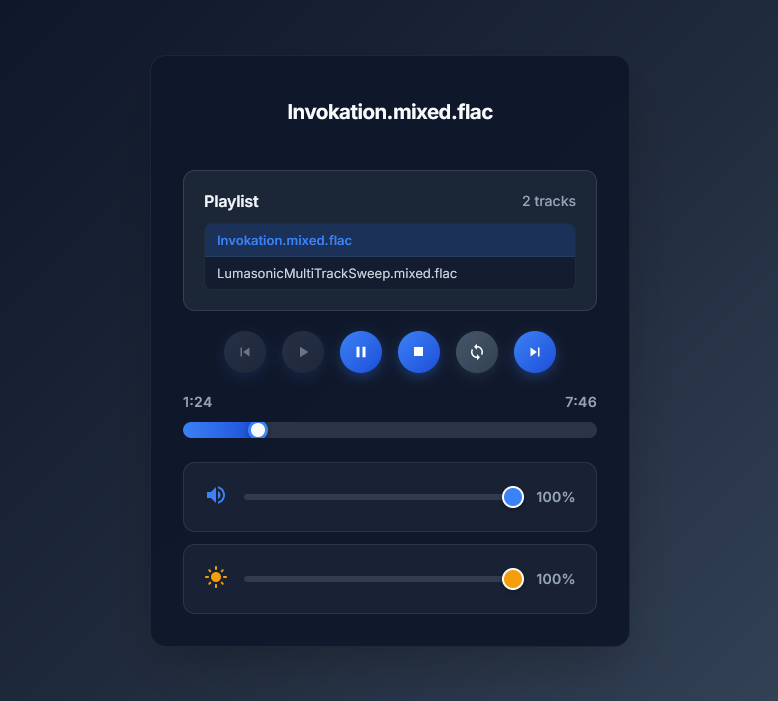

## Web Player Interface for Lumasonic File Player

This folder implements an example HTML5 & JavaScript web player interface that interacts
with the Lumasonic File Player's REST API.



For more information on how to use the **LumasonicFilePlayer** class see the
[documentation](../../docs/html/class_lumasonic_file_player.html).

You can use this folder with the provided [lsfplayer example](../../examples/player) using the **--web-dir** argument:

```shell
lsfplayer --debug --thread-mode=efficient --audio-settings=~/path/to/AudioDeviceSettings.xml --content-dir=~/LumasonicSdk/media --web-server=8080 --web-dir=~/LumasonicSdk/tools/www ~/LumasonicSdk/media/file.flac
```